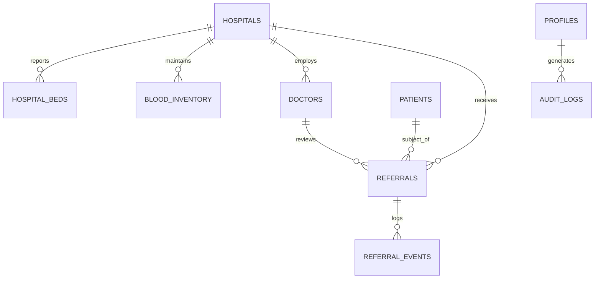

# ASTRA Supabase Migration Strategy & Architecture Guide
**Target Supabase Project**: `astra-production-demo`  
**Application**: ASTRA Emergency Referral Coordination Platform  

---

## 1. Current Architecture Overview

ASTRA is built on React 18, Vite, TypeScript, Tailwind CSS, and Zustand. 

### Portals & Personas
1. **User / Patient Portal**:
   - `/user/emergency`: Emergency intake wizard (Category, Patient Age, Chief Complaint, Capability Requirements).
   - `/user/facilities`: Suitable facilities directory with live-ish bed telemetry, AC vs Non-AC, General vs Private, ICU/Emergency beds, Blood bank availability, Distance, and Freshness (`LIVE`, `RECENT`, `STALE`).
   - `/user/history`: Historical referral logs.
2. **Hospital Operations Portal**:
   - `/hospital/dashboard`: Real-time intake queue, operational metrics, bed allocation management (`available + occupied + reserved <= total`).
   - `/hospital/referrals`: Incoming emergency referrals, routing to clinical teams, bed reservation confirmation.
3. **Doctor / Clinical Command Center**:
   - `/doctor/dashboard`: Assigned patient queue, triage urgency, specialty routing (Cardiology, Neurology, Emergency Medicine, Trauma), blood group matching, clinical reviews, and clinical override decisions.
   - Clinical banner: *"Clinical decision by authorized medical professional. Algorithmic matching provides decision support only."*
4. **ASTRA Admin Portal**:
   - `/admin/dashboard`: Platform command center, hospital registry verification, escalation queue, capability audits, and immutable system audit logs.

---

## 2. Existing Mock Entities & Relationships



### Existing Data Models
- **`Hospital`**: `id`, `name`, `type` (GOVERNMENT / PRIVATE / TRUST), `address`, `location` (`lat`, `lng`), `capabilities`, `verificationStatus`, `lastUpdated`.
- **`BedAvailability`**: `category` (ICU, EMERGENCY, HDU, GENERAL, etc.), `comfort` (AC / NON_AC), `roomType` (PRIVATE / SHARED), `totalBeds`, `availableBeds`, `occupiedBeds`, `reservedBeds`, `chargePerDay`.
- **`BloodInventoryItem`**: `hospitalId`, `bloodGroup` (A+, A-, B+, B-, AB+, AB-, O+, O-), `availableUnits`, `reservedUnits`, `status`, `lastUpdated`, `freshness`.
- **`Doctor` / `SpecialistTeamMember`**: `doctorId`, `doctorName`, `specialty` (Cardiology, Trauma, Emergency Medicine, etc.), `hospitalId`, `onCall`, `status`.
- **`PatientBrief`**: `referenceCode`, `age`, `sex`, `chiefComplaint`, `emergencyCategory`, `urgencyLevel`, `bloodGroup`.
- **`Referral`**: `id`, `patient`, `status`, `sentToFacilityId`, `assignedDoctorId`, `matchedFacilities`, `timeline`, `decision`.

---

## 3. Proposed Supabase PostgreSQL Schema

### 10 Core Relational Tables
1. **`profiles`**: Linked to `auth.users(id) ON DELETE CASCADE`. Tracks `role` (`'USER' | 'HOSPITAL_OPS' | 'DOCTOR' | 'ADMIN'`), `hospital_id`, `doctor_id`, `name`, and timestamps.
2. **`hospitals`**: Facility metadata, unique code, GPS coordinates, tier, contact info, and verification status.
3. **`hospital_beds`**: Fine-grained bed telemetry with categories (`ICU`, `HDU`, `EMERGENCY`, `GENERAL`, `PRIVATE`), comfort (`AC` / `NON_AC`), room type, daily tariff, and constraint:
   `CHECK (available_beds + occupied_beds + reserved_beds <= total_beds)`.
4. **`blood_inventory`**: Real-time units for all 8 blood groups (A+, A-, B+, B-, AB+, AB-, O+, O-) per facility.
5. **`doctors`**: Clinical personnel, specialty, hospital mapping, medical registration number, and on-call availability.
6. **`doctor_specialties`**: Many-to-many relationship supporting multi-specialty clinicians.
7. **`patients`**: Anonymized emergency intake cases (`reference_code`, `age`, `sex`, `chief_complaint`, `urgency_level`, `vital_signs`).
8. **`referrals`**: Core referral state machine (`MATCHED`, `PENDING_TRIAGE`, `REVIEWING`, `INFO_REQUESTED`, `PENDING_CONFIRMATION`, `CONFIRMED`, `ARRIVED`, `COMPLETED`, `DECLINED`, `ESCALATED`).
9. **`referral_events`**: Immutable timeline events logging state transitions, notes, and actors.
10. **`audit_logs`**: System-wide compliance and security audit logs.

---

## 4. Authentication, RBAC & RLS Strategy

### Authentication
- Uses `@supabase/supabase-js` `supabase.auth.signInWithPassword` and `supabase.auth.signOut`.
- User roles are resolved server-side from `public.profiles` where `profiles.id = auth.uid()`, preventing client-side privilege spoofing.
- Demo credentials fallback is retained via `MockDatabase` when Supabase credentials are not yet configured.

### Row Level Security (RLS) Policies
- **`hospitals`, `hospital_beds`, `blood_inventory`**:
  - `SELECT`: Public / authenticated access so patients and referring units can see facility capabilities.
  - `UPDATE / INSERT`: Restricted to `HOSPITAL_OPS` for their own `hospital_id` and `ADMIN`.
- **`referrals`**:
  - `SELECT`: Users see referrals they created; Hospital staff see referrals routed to their hospital; Doctors see referrals assigned to their clinical queue; Admins see all.
  - `UPDATE`: Only attending `DOCTOR` (for clinical acceptance/decline) or `HOSPITAL_OPS` (for triage and bed confirmation).
- **`audit_logs` & `referral_events`**:
  - `INSERT`: Permitted for authenticated actors.
  - `UPDATE / DELETE`: Denied for all users (append-only ledger).

---

## 5. Repository Layer Architecture

To prevent direct Supabase calls from polluting UI components, all database interaction is mediated through dedicated repositories:

```
src/services/repositories/
├── hospitalRepository.ts  # Fetches hospitals, verifies capabilities
├── bedRepository.ts       # Manages bed counts, AC/Non-AC tariffs, capacity invariants
├── bloodRepository.ts     # Real-time blood units and ABO/Rh matching
├── doctorRepository.ts    # Specialist roster and specialty matching
├── patientRepository.ts   # Synthetic emergency patient creation
└── referralRepository.ts  # Referral state transitions and timeline auditing
```

Each repository queries Supabase first. If Supabase is unconfigured or unreachable, it gracefully falls back to `MockDatabase`.

---

## 6. Migration Roadmap Summary

| Component | Status in Phase 1 | Target in Subsequent Phases |
| :--- | :--- | :--- |
| **Database Schema** | Fully defined in `supabase/schema.sql` (10 tables, RLS, triggers) | Applied to live Supabase project |
| **Seed Data** | 4 Hospitals, 6 Doctors, 10 Patients, 8 Blood Groups, multi-tier beds | Expanded to 8–12 hospitals in Phase 2 |
| **Auth & Profiles** | Handled by `authService.ts` with Supabase + demo fallback | Full Supabase Auth session persistence |
| **Hospital Availability Slice** | **Live Supabase queries via `hospitalRepository` & `bedRepository`** | WebSocket Realtime telemetry updates |
| **Doctor Review Queue** | Integrated with mock and database adapters | Multi-specialty clinical queue in Phase 4 |
| **Hospital Operations** | Validates `available + occupied + reserved <= total` | Complete live bed allocation in Phase 5 |
| **Admin Simulation & Audit** | Read/write support in database adapter | Advanced simulation scenarios in Phase 6 |
